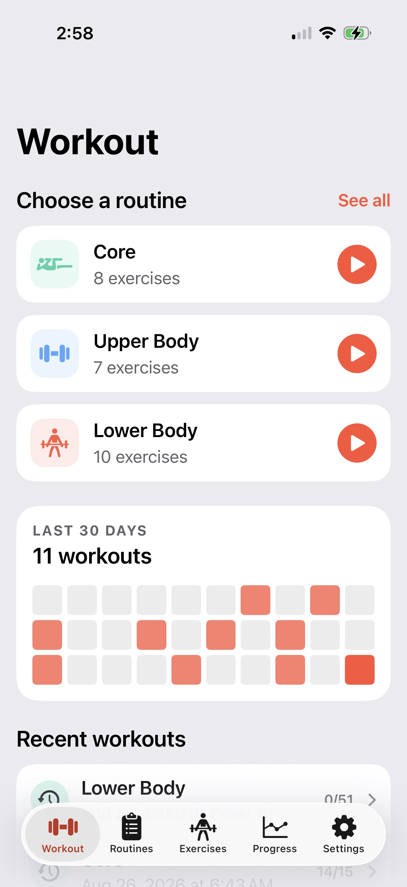

# StrengthLog

StrengthLog is an offline-first iPhone app for tracking strength routines alone or with a configurable training crew. It combines quick, one-row-per-person set logging with resumable sessions, latest per-person workout defaults, an 873-exercise catalog, activity history, and pounds-volume charts.



## Included in the MVP

- Optionally add editable Upper Body, Lower Body, and Core starter routines, or create routines from scratch.
- Set up the training crew in onboarding; no personal names or routines are shipped in the app.
- Use each exercise's saved catalog unit consistently across routines and workouts, with corrections made from exercise detail.
- Start exactly one live routine with a selected subset of people.
- While a workout is open it replaces the tab interface, keeping the entire app focused on logging.
- Complete sets in order, remove an accidental latest set, edit load/reps, add exercises, reorder exercises, and hide people in a continuously saved workout log.
- Close a workout whenever you like and reopen any of the three most recent logs directly from Workout—there is no timer or finish step.
- Persist every participant's completed sets and use each person's latest configuration as next-time defaults.
- Browse/search 873 offline exercise records and swipe through two-position form imagery on demand, including from a live workout.
- Use separate Routines and Exercises tabs for routine composition and catalog browsing.
- View a 30-day activity grid, history, and pounds-volume charts.
- Import Hevy workout CSV files from Settings or the iOS share/open sheet, choose which routines to create, review every relevant exercise mapping, and secondarily import deduplicated history for one local person.

## Run

```sh
make sim-launch
```

The default simulator and physical device are both Chase's iPhone 17 Pro. See [setup and installation](docs/setup-install.md) for details and [exercise catalog research](docs/exercise-catalog-research.md) for sourcing/licensing decisions.
